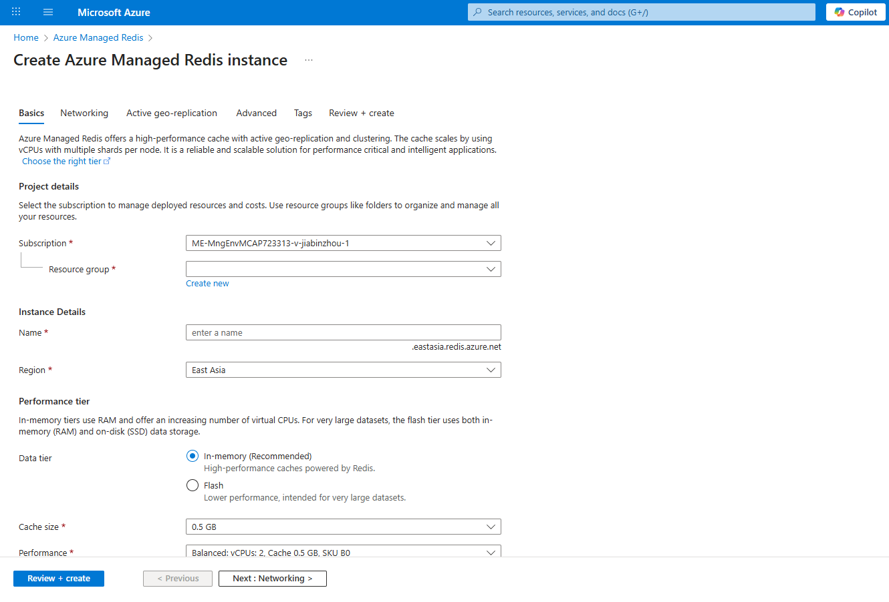
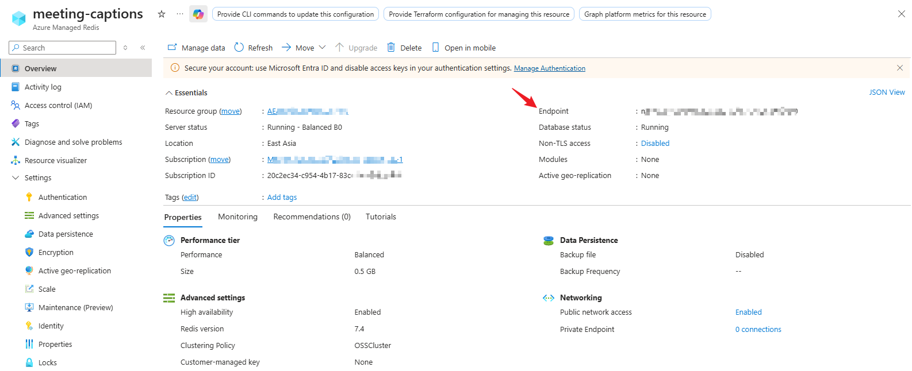
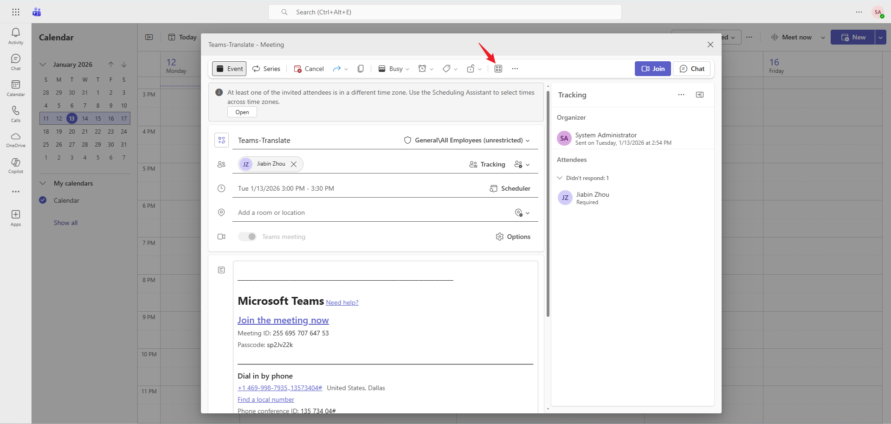
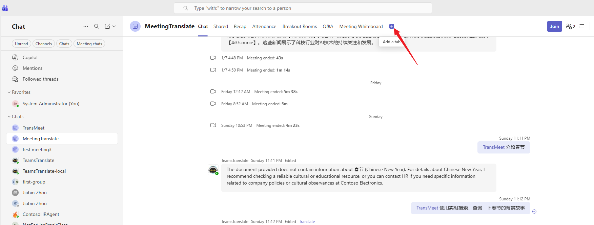
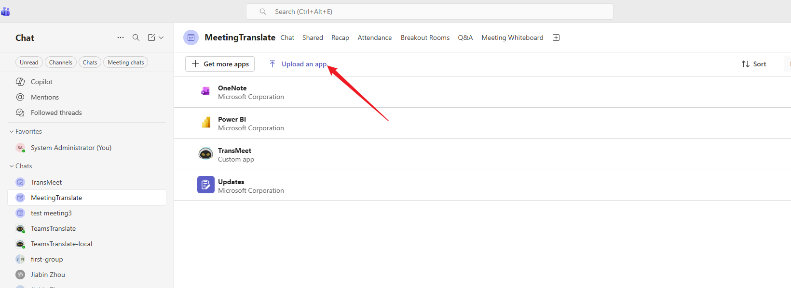
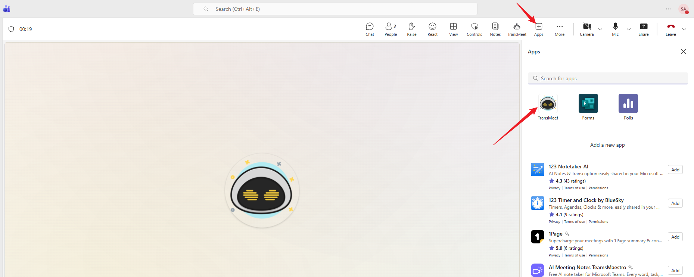
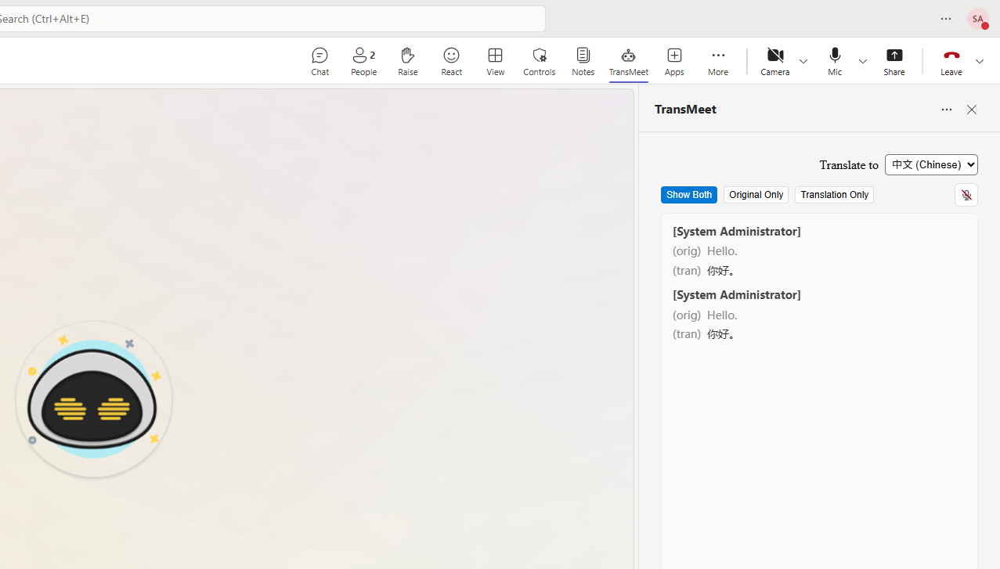

# Bot to show the transcript of the meeting.

**Description**: This application shows how to work with the stream of data from the audio socket in a Teams meeting. When the Bot is added to a meeting it will listen and transcript everything that is said. If you decide to use the Speech Service mode, then the bot will use Azure AI Speech Service to convert the Text-To-Speech and you will hear the speaking in a Bot's voice.

The sample also includes scripts and pipelines to deploy the infrastructure and code to run the Bot in Azure on VMSS.

## Getting Started

* Clone the Git repo. Please see the instructions [here](https://docs.microsoft.com/en-us/vsts/git/tutorial/clone?view=vsts&tabs=visual-studio) to get started with VSTS Git.
* Log in to your Azure subscription to host web sites and bot services.
* Launch Visual Studio Code or open a terminal to the root folder of the sample.
* Fork the repo or clone it and then push it to your own repo in GitHub.

## Prepare a PFX Certificate

The Bot requires an SSL certificate signed by a Certificate Authority. If you don't have a certificate for your domain, you can create a free SSL certificate.

1. Verify you have access to make DNS changes to your domain or buy a new domain.
2. Install [certbot](https://certbot.eff.org/instructions?ws=other&os=windows). 
    * Follow the installation instructions
    * If 'certbot' command is not recognized in the terminal, add the path to the certbot.exe to the environment variables path ($env:Path)
3. Open a terminal as an Adminstrator where certbot is loaded
4. Execute `certbot certonly --manual --preferred-challenges=dns -d '*.example.com' --key-type rsa`
5. This will create a wildcard certificate for example.com.
6. Follow the instructions and add the TXT record to your domain
7. This will create PEM certificates and the default location is 'C:\Certbot\live\example.com'
8. Install [OpenSSL](https://slproweb.com/products/Win32OpenSSL.html) to convert the certifcate from PEM to PFX
9. Execute `openssl pkcs12 -export -out C:\Certbot\live\example.com\star_example_com.pfx -inkey C:\Certbot\live\example.com\privkey.pem -in C:\Certbot\live\example.com\cert.pem`

## Bot Registration

1. Follow the instructions [Register a Calling Bot](https://microsoftgraph.github.io/microsoft-graph-comms-samples/docs/articles/calls/register-calling-bot.html). Take a note of the registered config values (Bot Id, MicrosoftAppId and MicrosoftAppPassword). You will need these values in the code sample config. NOTE: This step is creating an Azure Bot. If the bot is not created and configured correctly, the bot will not be able to join the meeting.

2. Add the following Application Permissions to the bot:
    - Calls.AccessMedia.All
    - Calls.JoinGroupCall.All

3. The permissions need to be consented by tenant admin. Go to "https://login.microsoftonline.com/common/adminconsent?client_id=<app_id>&state=<any_number>&redirect_uri=<any_callback_url>" using tenant admin to sign-in, then consent for the whole tenant.

## Prerequisites

### General
- Visual Studio (only needed if running locally). You can download the community version [here](http://www.visualstudio.com/) for free.
- PowerShell (5.0/7.0+)
- Mirosoft Azure Subscription (If you do not already have a subscription, you can register for a [free account](https://azure.microsoft.com/en-us/free/))
- An Office 365 tenant enabled for Microsoft Teams, with at least two user accounts enabled for the Calls Tab in Microsoft Teams (Check [here](https://docs.microsoft.com/en-us/microsoftteams/configuring-teams-calling-quickstartguide) for details on how to enable users for the Calls Tab)

### Setup Script
- [Azure CLI](https://learn.microsoft.com/en-us/cli/azure/install-azure-cli?view=azure-cli-latest)
- [GitHub CLI](https://cli.github.com/)
  * This is not a hard requirement, but will automate the step to save the secret in your repo.
- Bicep
  * Execute `az bicep install` to install Bicep.
  * Ensure that the Azure CLI binary path is added to the system environment variables (Windows: `C:\Users\<you>\.azure\bin`).
- Az module
  * `Install-Module -Name Az -Repository PSGallery -Scope CurrentUser`
- Must be an owner of the Azure subscription where you are deploying the infrastructure.
- Must have permissions to create an Entra ID(Azure AD) Application.
- Note: The Azure Bot must be created in a tenant where you are an adminstrator because the bot permissions require admin consent. The bot infrastructure does not need to be in the same tenant where the Azure bot was created. This is useful if you are not an administrator in your tenant and you can use a separate tenant for the Azure Bot and Teams calling.

| Secret Name          | Message |
| -------------------- |:-------------|
| localadmin           | 'localadmin' is the username for the admin on the provisioned VMSS VMs. The password entered is the password to login and will be configured for all VMs. |
| AadAppId             | This is the Azure AD Application Client Id that was created when creating an Azure Bot. Refer to the [registration instructions](https://microsoftgraph.github.io/microsoft-graph-comms-samples/docs/articles/calls/register-calling-bot.html) |
| AadAppSecret         | Client Secret created for the Azure AD Application during the Azure Bot registration. |
| ServiceDNSName       | Your public domain that will be used to join the bot to a call (ie bot.example.com) |
| SpeechConfigKey      | The Speech Service Key |
| SpeechConfigRegion   | The region where the Speech Service is deployed |
| CustomSpeechEndpoints| The model id of Azure Custom Speech |
| Translator.Routing   | The category of Azure Custom Translator |
| Redis.Configuration  | The endpoint of Azure Managed Redis |

## Deploy

### PowerShell DSC

PowerShell Desired State Configuration (DSC) enables you to manage your IT development infrastructure with configuration as code. This sample uses DSC to configure the VMs to run the Teams Voice Echo Bot. Here are a few examples of where we are using DSC:
  - Set environment variables on the VM
  - Install software
  - Install the windows service

DSC Resources
  - https://docs.microsoft.com/en-us/powershell/scripting/dsc/overview?view=powershell-5.1
  - https://docs.microsoft.com/en-us/azure/virtual-machines/extensions/dsc-overview
  - https://github.com/dsccommunity

### Deploy the Prerequistes

1. Navigate to the root directory of the sample in PowerShell.
2. Run `az login/Connect-AzAccount` to ensure you are deploying to the correct subscription
    - You need to have the owner role on the subscription/resource group
    - You need permissions to create a Service Principal
3. Run `.\deploy.ps1 -OrgName <Your 2 - 7 Character Length Letter Abbreviation>`
    - ie .\deploy.ps1 -OrgName TEB -Location eastus2
```bash
    # Option 1. Execute all pre-req steps i.e. run setup to deploy
    ./deploy.ps1 -orgName <yourOrgName> -Location centralus
    # E.g.
    ./deploy.ps1 -orgName DNA -Location centralus
    
    # Option 2. After you have run setup the first time, re-execute setup
    ./deploy.ps1 -orgName <yourOrgName> -Location centralus -RunSetup
    # E.g.
    ./deploy.ps1 -orgName DNA -Location centralus -RunSetup
    
    # Option 3a. After you have run setup you can deploy from the commandline
    ./deploy.ps1 -orgName <yourOrgName> -Location centralus -RunDeployment
    # E.g.
    ./deploy.ps1 -orgName DNA -Location centralus -RunDeployment

    # Option 3b. Alternatively skip 4a, check your code changes in and push to your repo
    # The deployment will exectute via GitHub workflow instead
    - You can manually run the 'BUILD' workflow to build the code
    - You can manually run the 'INFRA' workflow after the previous workflow to deploy the infrastructure
```

This script will do the following:
1. Create a resource group with the naming convention ACU1-TEB-BOT-RG-D1 (Region Abbreviation - Your Org Name - BOT - Resource Group - Environment)
2. Create a storage account
    - Grant current user the 'Storage Blob Data Contributor' role
    - Grant the service principal the 'Storage Blob Data Contributor' role
3. Create a Key Vault
    - And grant current user the 'Key Vault Administrator' role
4. Create an Azure AD Application
    - The Application will be granted the 'Owner' role to the subscription.
5. Crete a GitHub Secret wiht name AZURE_CREDENTIALS__BOT
    ```json
    {
        "clientId": "<GitHub Service Principal Client Id>",
        "clientSecret": "<GitHub Service Principal Secret>",
        "tenantId": "<Tenant ID>",
        "subscriptionId": "<Subscription ID>",
        "activeDirectoryEndpointUrl": "https://login.microsoftonline.com",
        "resourceManagerEndpointUrl": "https://management.azure.com/",
        "activeDirectoryGraphResourceId": "https://graph.windows.net/",
        "sqlManagementEndpointUrl": "https://management.core.windows.net:8443/",
        "galleryEndpointUrl": "https://gallery.azure.com/",
        "managementEndpointUrl": "https://management.core.windows.net/"
    }
    ```
6. Generate the deployment parameters file, build workflow and infrastructure workflow
7. Upload the PFX certificate to Key Vault
8. Add the secrets and environment variables to Key Vault

After the script runs successfully, you should see the following:
1. New resource group with the following resources
    - Storage Account
    - Key Vault
2. Azure AD Application in Azure AD
3. In your GitHub Repo, Navigate to Settings > Secrets. You should see a new secret named 'AZURE_CREDENTIALS__BOT'
4. Three new files have been created. Check these files in and push them to your repo.
    - app-build-.yml
    - app-infra-release-.yml
    - azuredeploy.parameters.json
5. Once these files have been pushed to your repo, they will kick of the infrastructure and code deployment workflows.

### Deploy the Infrastructure

The GitHub Action app-infra-release-.yml deploys the infrastructure.

You can also run the infrastructure deployment locally using the -RunDeployment flag.
```bash
./deploy.ps1 -OrgName TEB -RunDeployment
```

### Add Redis cache service

In Azure portal, add a instance of `Azure Managed Redis`


Get redis endpoint and key


### Update DNS
Your DNS Name for your bot needs to point to the public load balacer in order to call your bot and have it join a meeting.
  1. Find the public IP resource for the load balancer and copy the DNS name.
  2. Navigate to your DNS settings for your domain and create a new CNAME record. ie CNAME bot acu1-teb-bot-d1-lbplb01-1.eastus2.cloudapp.azure.com

### Deploy the Solution
The GitHub Action app-build-.yml builds the solution and uploads the output to the storage account. Once the infrastructure is deployed, DSC will pull the code from the storage account.

## Experience the application

Add the bot to Meeting (from calendar).


Add the bot from meeting channel


For developer (upload the zip file)


Add the bot in the meeting



---

# RSC Enable Configuration  

To enable **Resource Specific Consent (RSC)**, please update the following configuration files:  

## 1. Update App Manifest Schema  

In your `manifest.json`, update the schema version:  

```json
"$schema": "https://developer.microsoft.com/json-schemas/teams/v1.23/MicrosoftTeams.schema.json",
"manifestVersion": "1.23",
```

## Add Authorization Permissions  

Add the following permissions inside the **authorization** section of your `manifest.json`:  

```json
"authorization": {
  "permissions": {
    "resourceSpecific": [
      {
        "name": "OnlineMeeting.ReadBasic.Chat",
        "type": "Application"
      },
      {
        "name": "OnlineMeetingTranscript.Read.Chat",
        "type": "Application"
      }
    ]
  }
}
```
## Update `m365agents.local.yml`  

- In the file `m365agents.local.yml`:  

- **Comment out** the section for `aad.manifest.json` (lines **52–55**).  
- **Comment out** the section for validating `appPackage` (lines **57–61**).


6. Setup Manifest for Teams
- __*This step is specific to Teams.*__
    - **Edit** the `manifest.json` contained in the ./appPackage folder to replace your Microsoft App Id (that was created when you registered your app registration earlier) *everywhere* you see the place holder string `{{Microsoft-App-Id}}` (depending on the scenario the Microsoft App Id may occur multiple times in the `manifest.json`)
    - **Edit** the `manifest.json` for `validDomains` and replace `{{domain-name}}` with base Url of your domain. E.g. if you are using ngrok it would be `https://1234.ngrok-free.app` then your domain-name will be `1234.ngrok-free.app` and if you are using dev tunnels then your domain will be like: `12345.devtunnels.ms`.
    - **Zip** up the contents of the `appPackage` folder to create a `manifest.zip` (Make sure that zip file does not contains any subfolder otherwise you will get error while uploading your .zip package)

- Upload the manifest.zip to Teams (in the Apps view click "Upload a custom app")
   - Go to Microsoft Teams. From the lower left corner, select Apps
   - From the lower left corner, choose Upload a custom App
   - Go to your project directory, the ./appPackage folder, select the zip folder, and choose Open.
   - Select Add in the pop-up dialog box. Your app is uploaded to Teams.

**Note**: If you are facing any issue in your app, please uncomment [this](https://github.com/OfficeDev/Microsoft-Teams-Samples/blob/main/samples/meetings-transcription/csharp/MeetingTranscription/AdapterWithErrorHandler.cs#L23) line and put your debugger for local debug.

## Interacting with the bot.
- After uploading the manifest add the bot into meeting.
- Join meeting and open TransMeet bot
- Speaking in the meeting
- You will see the transcription in the bot's panel